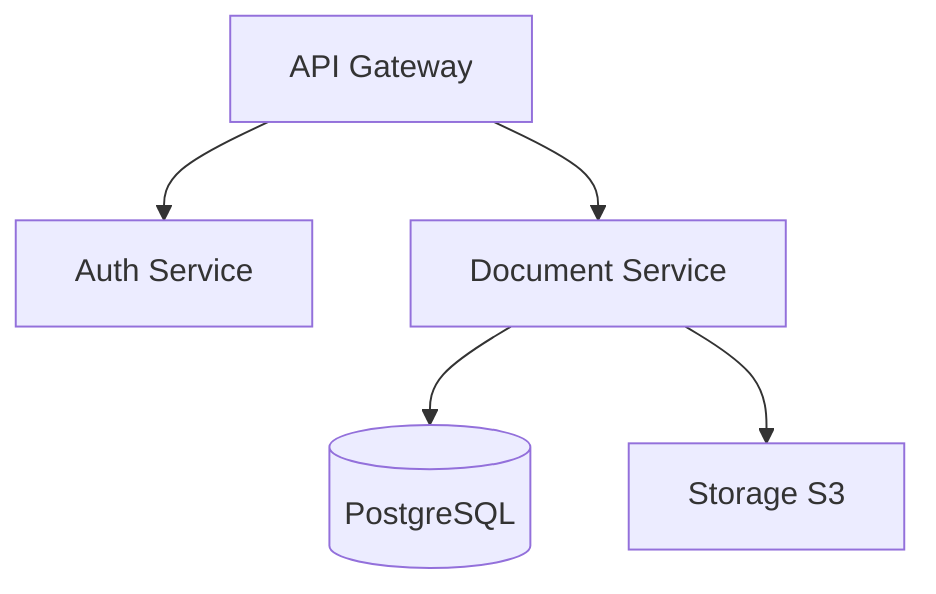

# MarkItDown Document Intelligence Service

**Drop in any document. Get back clean Markdown — with tables intact, scans OCR'd, images described, and data extracted.**

Most document-to-Markdown tools work fine until you hand them a real-world file: a scanned invoice, a DOCX full of charts, an Excel with merged cells across 12 sheets, or a meeting recording. Then they silently fail, return empty text, or lose all structure. This service fixes that.

Built on Microsoft's [markitdown](https://github.com/microsoft/markitdown), extended with Mistral OCR-3, Vision AI, audio transcription, and a hybrid routing engine that picks the best tool for each document — automatically. Two interfaces: **MCP server** (for Claude and AI agents) and **REST API** (for n8n, workflows, and custom integrations). 501 unit tests. Self-hosted in a single Docker container.

---

## The Problem

You need documents as Markdown — for RAG pipelines, LLM context, search indexing, or archiving. Microsoft's markitdown handles clean text files well. But production documents are rarely clean:

- **Scanned PDFs come back empty.** No embedded text layer → no output. Your invoices, contracts, and forms vanish.
- **Multi-page tables get cut at page boundaries.** A 200-row dataset split across 4 pages becomes 4 unrelated fragments.
- **Images in DOCX and PPTX are silently dropped.** Charts, architecture diagrams, screenshots — replaced with `[image]` placeholders.
- **No intelligence.** No OCR, no document classification, no field extraction. Need invoice numbers or contract dates? Build it yourself.
- **No audio or video.** Meeting recordings, training videos, voice memos — completely out of scope.
- **One tool for every format.** A scanned PDF and a clean text PDF hit the exact same code path, with very different results.

## The Solution

This service wraps markitdown and routes each document through the best available tool for that specific format and situation:

- **Hybrid Routing:** file type + content analysis determines the processing path. A scanned PDF gets OCR-3; a text PDF with tables gets pdfplumber with cross-page merging; a DOCX with diagrams gets Vision.
- **Mistral OCR-3 for scans** — dedicated `/v1/ocr` endpoint with high accuracy ([Mistral benchmarks](https://mistral.ai/news/mistral-ocr-3): 96.6% table accuracy, 88.9% handwriting recognition). Vision model as fallback for page-by-page rendering.
- **Cross-Page Table Merger** — consecutive tables are compared by column count; headers are deduplicated; the result is a single coherent table regardless of page breaks.
- **Document Intelligence** — classify document type with confidence score, extract structured fields against any JSON Schema, quality scoring on every response.
- **High-Accuracy Pipeline** — OCR-3 → LLM correction → dual-pass Vision cross-validation → schema extraction. The original image goes back to the Vision model alongside the OCR output so structural errors and column misalignments get caught and fixed.
- **Audio and video** — faster-whisper with automatic language detection, ffmpeg audio extraction, model caching.
- **37 configurable ENV variables.** Nothing is hardcoded. Model selection, timeouts, thresholds, chunk sizes — all adjustable without touching source code.

---

## What It Looks Like

### Scanned PDF

A scanned government form with handwritten annotations. Standard converters return **empty Markdown** because there is no embedded text layer. This service detects the scan, routes it through Mistral OCR-3, corrects recognition errors, and cross-validates against the original image.

```bash
curl -X POST http://localhost:18006/v1/convert \
  -H "Content-Type: application/json" \
  -d '{"path": "/data/scan.pdf", "accuracy": "high"}'
```

**Markdown output** (the `markdown` field — always present):

```markdown
# Tax Form 2025

## Section 1: Personal Information

**Name:** John Smith
**Date of Birth:** 1979-04-12
**Tax ID:** DE12345678

## Section 2: Income

| Category | Amount |
|----------|--------|
| Employment | 72,400.00 EUR |
| Capital gains | 1,840.00 EUR |

## Annotations

> *Handwritten note (margin):* "Pending correction — see attachment"
```

**Response metadata** (tells you what happened under the hood):

```json
{
  "success": true,
  "meta": {
    "scanned": true,
    "ocr_model": "mistral-ocr-2512",
    "quality_score": 0.93,
    "quality_grade": "excellent",
    "pipeline_steps": ["scan_detection", "ocr3", "ocr_correction", "dual_pass_validation"],
    "duration_ms": 3840
  }
}
```

### Invoice Extraction

A supplier invoice. You need both the readable Markdown **and** structured JSON fields for your accounting system. The service delivers both in one call.

```bash
curl -X POST http://localhost:18006/v1/extract \
  -H "Content-Type: application/json" \
  -d '{"path": "/data/invoice.pdf", "template": "invoice"}'
```

**Markdown output** (always present — the full document as readable Markdown):

```markdown
# Invoice INV-2026-0187

**Vendor:** Acme Software GmbH
**Customer:** Meridian Technologies AG
**Date:** 2026-03-15

| Pos | Description | Qty | Unit Price | Total |
|-----|-------------|-----|-----------|-------|
| 1 | Annual license — Enterprise Plan | 1 | 4,800.00 EUR | 4,800.00 EUR |
| 2 | Professional Services (16h) | 16 | 185.00 EUR | 2,960.00 EUR |

**Subtotal:** 7,760.00 EUR
**VAT (19%):** 1,474.40 EUR
**Total:** 9,234.40 EUR

**IBAN:** DE89 3704 0044 0532 0130 00
**Payment terms:** 30 days net
```

**Extracted JSON** (the `extracted` field — only present when using `template` or `extract_schema`):

```json
{
  "extracted": {
    "invoice_number": "INV-2026-0187",
    "date": "2026-03-15",
    "vendor": "Acme Software GmbH",
    "customer": "Meridian Technologies AG",
    "line_items": [
      { "description": "Annual license — Enterprise Plan", "quantity": 1, "unit_price": 4800.00, "total": 4800.00 },
      { "description": "Professional Services (16h)", "quantity": 16, "unit_price": 185.00, "total": 2960.00 }
    ],
    "subtotal": 7760.00,
    "vat_rate": 0.19,
    "vat_amount": 1474.40,
    "total": 9234.40,
    "currency": "EUR",
    "iban": "DE89370400440532013000",
    "payment_terms": "30 days net"
  },
  "meta": {
    "document_type": "invoice",
    "document_type_confidence": 0.97,
    "quality_score": 0.89,
    "duration_ms": 2210
  }
}
```

### DOCX with Embedded Images and Diagrams

A technical report with architecture diagrams and performance charts. Standard converters drop all images and return `[image]` placeholders. This service classifies each image and handles it per type: diagrams become Mermaid syntax, charts become data tables, photos get descriptions.

```bash
curl -X POST http://localhost:18006/v1/convert \
  -H "Content-Type: application/json" \
  -d '{"path": "/data/report.docx", "describe_images": true, "classify": true}'
```

**Markdown output** (images replaced with actual content):

````markdown
# Q1 System Architecture Review

## Overview

This report covers the architectural changes and performance improvements in Q1 2026.

## System Architecture



## Performance Metrics (Q1 2026)

| Month | Requests/s | P99 Latency | Error Rate |
|-------|-----------|-------------|------------|
| Jan | 4,200 | 142ms | 0.03% |
| Feb | 5,100 | 138ms | 0.02% |
| Mar | 6,800 | 155ms | 0.04% |

## Team Photo

*[Photo: engineering team of 8 people at a standup meeting, whiteboard visible in background]*
````

**Response metadata:**

```json
{
  "meta": {
    "document_type": "technical_doc",
    "document_type_confidence": 0.91,
    "images_processed": 3,
    "image_types": { "diagram": 1, "chart": 1, "photo": 1 },
    "quality_score": 0.88,
    "duration_ms": 5620
  }
}
```

The architecture diagram was converted to Mermaid syntax (renderable in GitHub, Obsidian, and most Markdown viewers). The performance chart was extracted as a data table. The team photo received a descriptive caption.

---

## The Gap This Fills

| Feature | markitdown (vanilla) | Unstructured.io | Azure Doc Intelligence | This Service |
|---------|---------------------|-----------------|----------------------|--------------|
| Scanned PDF / OCR | No | Yes | Yes | Yes (Mistral OCR-3) |
| Cross-page table merging | No | Partial | Yes | Yes |
| Embedded image intelligence | No (placeholders) | No | No | Yes (classify + describe + Mermaid) |
| Audio / Video transcription | No | No | No | Yes (faster-whisper) |
| Document classification | No | Partial | Yes | Yes (configurable categories) |
| Schema extraction | No | No | Partial | Yes (any JSON Schema + templates) |
| Quality scoring | No | No | No | Yes (per-response score + grade) |
| MCP interface | No | No | No | Yes (SSE + stdio) |
| Self-hosted | Yes | Yes | No (cloud only) | Yes (Docker, single container) |
| Deployment complexity | Minimal | Heavy (PyTorch + models) | Cloud SaaS | Minimal (docker compose up) |
| Pricing | Free | Open source / paid SaaS | Per-page API cost | API cost only (Mistral) |
| Test coverage | — | — | — | 501 unit tests |

markitdown alone is a lightweight starting point. Unstructured.io is a heavy dependency tree (PyTorch, multiple model downloads) with no MCP interface. Azure and AWS document services are cloud-only, have per-page pricing, and require data to leave your infrastructure. This service is a single Docker container with a Mistral API key — self-hosted, MCP-native, and covering all the gaps.

---

## How It Works

### Hybrid Routing Algorithm

When a request arrives, the router identifies the format using both the file extension and MIME type from magic bytes (not trusting the filename alone). It then applies format-specific logic:

For PDFs, the router calls `pdftotext` and counts characters per page. If the average falls below `SCAN_THRESHOLD_CHARS` (default: 50 characters per page), the document lacks a usable text layer and is routed to Mistral OCR-3. Text PDFs go to pdfplumber for table-aware extraction with img2table as a fallback for image-embedded tables. PyMuPDF handles metadata, bookmarks, annotations, and form fields in parallel.

Images go directly to the Mistral Vision model after an optional resize pass (capped at `IMAGE_MAX_WIDTH` pixels). Documents with embedded images (DOCX, PPTX) are extracted via zip traversal (`word/media/`, `ppt/media/`) and each image is classified before processing.

Audio and video files are sent to faster-whisper. Video files first go through ffmpeg to extract a 16kHz mono WAV stream.

### Cross-Page Table Merger

pdfplumber extracts tables on a per-page basis. The merger algorithm inspects consecutive table pairs:

1. Compare column counts. If they match exactly, the tables are candidates for merging.
2. Check if the first row of the second table is a repeated header (identical to the first table's header). If so, drop the duplicate.
3. Append the rows of the second table to the first.
4. Continue for all subsequent pages.

The result is a single Markdown table that spans the original page breaks, with no duplicate headers and no row cuts in the middle of a dataset.

### High-Accuracy Pipeline

When `accuracy: "high"` is set, the service runs a four-step pipeline instead of a single OCR pass:

1. **Mistral OCR-3** — the document is sent to the dedicated `/v1/ocr` endpoint. This produces raw Markdown with the highest available OCR accuracy.
2. **LLM OCR Correction** — the OCR output is sent to the text model with instructions to fix common recognition errors (character substitutions, line breaks in the middle of words, garbled special characters) while preserving layout, language, and Markdown structure.
3. **Dual-Pass Vision Validation** — the first page is rendered as an image and sent to the Vision model together with the corrected OCR text. The model cross-validates structure, table column alignment, and content. This catches structural errors that pure text-based OCR misses.
4. **Schema Extraction** (if `extract_schema` or `template` is provided) — the validated Markdown is passed to the text model with a JSON Schema. The model returns a structured JSON object matching the schema exactly.

Every stage that ran is listed in `pipeline_steps` in the response metadata. This lets you verify which path was taken and debug routing decisions.

---

## Quick Start

### Prerequisites

- [Docker](https://docs.docker.com/get-docker/) and [Docker Compose](https://docs.docker.com/compose/install/)
- A [Mistral API key](https://console.mistral.ai/api-keys/) (required for Vision, OCR, classification, and extraction features)

### System Requirements

The container is lightweight by design — no PyTorch, no Java, no GPU required.

| Resource | Minimum | Recommended | Notes |
|----------|---------|-------------|-------|
| **CPU** | 1 core | 2+ cores | Parallel conversions benefit from more cores |
| **RAM** | 512 MB | 1–2 GB | Whisper audio transcription uses more RAM with larger models |
| **Disk** | ~1 GB | 2+ GB | Container image (~800 MB) + space for documents |
| **GPU** | Not required | Optional | Set `WHISPER_DEVICE=cuda` for faster audio transcription |
| **Network** | Outbound HTTPS | — | Required for Mistral API calls (Vision, OCR, classification) |

Without the Mistral API key, the service still works for basic document conversion (PDF, DOCX, XLSX, etc. via markitdown) — Vision, OCR, classification, and extraction features are gracefully disabled.

### Installation

```bash
# Clone the repository
git clone https://github.com/Hanz74/markitdown-mcp.git
cd markitdown-mcp

# Create your configuration
cp .env.example .env
```

Edit `.env` and set your Mistral API key:

```
MISTRAL_API_KEY=your-api-key-here
```

### Build and Run

```bash
docker compose build
docker compose up -d
```

This starts the MarkItDown MCP server with two interfaces:

| Interface | Port | URL | Purpose |
|-----------|------|-----|---------|
| REST API | 18006 | `http://localhost:18006/docs` | Swagger UI, HTTP clients, n8n |
| MCP Server | 18005 | SSE transport | Claude, MCP clients |

### Verify

```bash
curl http://localhost:18006/v1/health
```

Expected response:

```json
{
  "status": "ok",
  "meta": {
    "mistral_api_configured": true,
    "vision_model": "mistral-small-2603",
    "ocr_model": "mistral-ocr-2512"
  }
}
```

### First Conversion

Place a file in the `data/` directory and convert it:

```bash
# Copy a PDF into the data directory
cp ~/my-document.pdf data/

# Convert it
curl -X POST http://localhost:18006/v1/convert \
  -H "Content-Type: application/json" \
  -d '{"path": "/data/my-document.pdf"}'
```

### Docker Compose Configuration

The `docker-compose.yml` is minimal by design:

```yaml
services:
  markitdown-mcp:
    build:
      context: ./mcp
    env_file: .env          # All configuration via .env
    ports:
      - "18005:8080"        # MCP Server (SSE)
      - "18006:8081"        # REST API (Swagger at /docs)
    volumes:
      - ./data:/data        # Document storage
```

All server settings are controlled through `.env`. See `.env.example` for the complete list of available variables with descriptions.

### Customizing the Model

By default, the service uses `mistral-small-2603` (fast, cost-effective). For maximum accuracy, set in `.env`:

```
MISTRAL_VISION_MODEL=mistral-large-latest
```

See [Mistral Models](#mistral-models-march-2026) for the full comparison.

---

## REST API (port 18006)

| Method | Path | Description |
|--------|------|-------------|
| `POST` | `/v1/convert` | Convert a file, base64 payload, or URL to Markdown |
| `POST` | `/v1/convert/folder` | Batch-convert all files in a directory |
| `POST` | `/v1/extract` | Extract structured data from a document |
| `POST` | `/v1/analyze` | Analyze and describe an image |
| `GET` | `/v1/templates` | List built-in extraction templates |
| `GET` | `/v1/formats` | List supported file formats |
| `GET` | `/v1/health` | Service health status |

Interactive API docs are available at `http://localhost:18006/docs`.

### Convert a PDF (standard)

```bash
curl -X POST http://localhost:18006/v1/convert \
  -H "Content-Type: application/json" \
  -d '{"path": "/data/report.pdf"}'
```

### Convert a scanned PDF with high accuracy

```bash
curl -X POST http://localhost:18006/v1/convert \
  -H "Content-Type: application/json" \
  -d '{
    "path": "/data/scan.pdf",
    "accuracy": "high"
  }'
```

The `high` accuracy pipeline runs: OCR-3 → LLM correction → dual-pass Vision cross-validation. The original image is sent back to the Vision model together with the OCR output so errors in structure and table columns are caught and fixed.

### Convert from base64

```bash
curl -X POST http://localhost:18006/v1/convert \
  -H "Content-Type: application/json" \
  -d '{
    "base64": "<base64-encoded-file>",
    "filename": "invoice.pdf"
  }'
```

### Convert a web page

Fetch any URL and convert its content to clean Markdown — useful for archiving articles, extracting documentation, feeding web content into RAG pipelines, or preprocessing pages for LLM consumption.

```bash
# Article / blog post → clean Markdown
curl -X POST http://localhost:18006/v1/convert \
  -H "Content-Type: application/json" \
  -d '{"url": "https://example.com/blog/article"}'

# Documentation page → structured Markdown with headings and code blocks
curl -X POST http://localhost:18006/v1/convert \
  -H "Content-Type: application/json" \
  -d '{"url": "https://docs.example.com/api/reference"}'

# Web page → Markdown + classify + chunk for RAG
curl -X POST http://localhost:18006/v1/convert \
  -H "Content-Type: application/json" \
  -d '{"url": "https://example.com/terms", "classify": true, "chunk": true}'
```

HTML is converted to Markdown via Microsoft's markitdown library, preserving headings, lists, tables, links, and code blocks. The optional `classify` and `chunk` parameters work with URL input just like with file input.

### Describe embedded images in a DOCX

```bash
curl -X POST http://localhost:18006/v1/convert \
  -H "Content-Type: application/json" \
  -d '{
    "path": "/data/presentation.docx",
    "describe_images": true,
    "language": "en"
  }'
```

### Classify a document

```bash
curl -X POST http://localhost:18006/v1/convert \
  -H "Content-Type: application/json" \
  -d '{
    "path": "/data/document.pdf",
    "classify": true
  }'
```

Response includes `document_type` and `document_type_confidence` in the `meta` field.

### Extract invoice fields using a template

```bash
curl -X POST http://localhost:18006/v1/extract \
  -H "Content-Type: application/json" \
  -d '{"path": "/data/invoice.pdf", "template": "invoice"}'
```

### Extract fields using a custom JSON Schema

```bash
curl -X POST http://localhost:18006/v1/convert \
  -H "Content-Type: application/json" \
  -d '{
    "path": "/data/contract.pdf",
    "extract_schema": {
      "type": "object",
      "properties": {
        "parties": {"type": "array", "items": {"type": "string"}},
        "effective_date": {"type": "string"},
        "value": {"type": "number"}
      }
    }
  }'
```

### Split a document into RAG chunks

```bash
curl -X POST http://localhost:18006/v1/convert \
  -H "Content-Type: application/json" \
  -d '{
    "path": "/data/manual.pdf",
    "chunk": true,
    "chunk_size": 512
  }'
```

Chunking is heading-aware: tables and code blocks are kept atomic and never split mid-structure.

**Choosing `chunk_size`:** This service splits text into chunks — it does not embed them. The chunk size should match the context window of the embedding model your RAG pipeline uses downstream:

| Embedding Model | Recommended `chunk_size` |
|-----------------|------------------------|
| Mistral `mistral-embed` (1024 dimensions) | 512–1024 |
| OpenAI `text-embedding-3-small` (1536 dimensions) | 512–1024 |
| OpenAI `text-embedding-3-large` (3072 dimensions) | 512–2048 |
| Local models (e.g. `all-MiniLM-L6`) | 256–512 |

The default of 512 tokens is a safe starting point for most embedding models. Token count is estimated as `characters / 4`.

### Transcribe audio or video

```bash
curl -X POST http://localhost:18006/v1/convert \
  -H "Content-Type: application/json" \
  -d '{"path": "/data/meeting.mp4"}'
```

Video audio is extracted via ffmpeg (16kHz mono WAV), then transcribed by faster-whisper with automatic language detection. The Whisper model is cached in memory after first load.

### Convert a folder

```bash
curl -X POST http://localhost:18006/v1/convert/folder \
  -H "Content-Type: application/json" \
  -d '{
    "path": "/data/documents",
    "recursive": true
  }'
```

---

## MCP Tools (port 18005)

| Tool | Description |
|------|-------------|
| `convert` | Convert a file, URL, or base64 payload to Markdown |
| `convert_folder` | Batch-convert all files in a directory |
| `extract` | Extract structured data using a template or custom schema |
| `health` | Return service health status |
| `list_files` | List files available in the data directory |

Both SSE (`MCP_TRANSPORT=sse`) and stdio (`MCP_TRANSPORT=stdio`) transports are supported.

---

## Processing Pipelines

### Standard Pipeline

```
Input (path / base64 / URL)
        │
        ▼
  Format detection
        │
   ┌────┴─────────────────────────────────┐
   │                                      │
   ▼                                      ▼
PDF (text)                          PDF (scanned)
   │                                      │
pdfplumber → table extraction       Mistral OCR-3 (/v1/ocr)
   + cross-page table merger              │ (fallback: Vision page-by-page)
   + img2table fallback                   │
   + code block fencing                   │
   + bookmarks → TOC                      │
   + annotations + form fields            │
   │                                      │
   └─────────────────┬────────────────────┘
                     │
            ┌────────┴────────┐
            │                 │
          DOCX              Excel
            │                 │
        comments          multi-sheet
        header/footer     chart tables
        track changes     formula annotations
        embedded images   merged cells
            │                 │
            └────────┬────────┘
                     │
              Audio / Video
                     │
              ffmpeg → WAV → Whisper
              (auto language detection)
                     │
                     ▼
                 Markdown output
                     │
          ┌──────────┼──────────┐
          │          │          │
      classify    extract    chunk
          │          │          │
      document   JSON Schema  RAG chunks
        type     extraction  (heading-aware)
```

### High-Accuracy Pipeline (`accuracy: "high"`)

```
Input
  │
  ▼
Mistral OCR-3 (/v1/ocr)
  │
  ▼
LLM OCR Correction  ← fixes recognition errors
  │
  ▼
Dual-Pass Vision Validation
  │  original image + OCR text → Vision model
  │  cross-validates structure, table columns, content
  │
  ▼
Schema Extraction (if extract_schema or template provided)
  │
  ▼
Structured JSON output + corrected Markdown
```

The `pipeline_steps` field in the response metadata lists every stage that ran.

---

## Request Options

| Parameter | Type | Default | Description |
|-----------|------|---------|-------------|
| `path` | `string` | — | File path inside the container (relative to `/data` or absolute) |
| `base64` | `string` | — | Base64-encoded file content |
| `filename` | `string` | — | Required when using `base64` |
| `url` | `string` | — | URL to fetch and convert |
| `accuracy` | `"standard"` \| `"high"` | `"standard"` | `high` activates OCR correction and dual-pass Vision validation |
| `classify` | `bool` | `false` | Classify document type with confidence score |
| `classify_categories` | `string[]` | see ENV | Override classification categories |
| `extract_schema` | `object` | — | JSON Schema for structured field extraction |
| `template` | `string` | — | Use a built-in extraction template |
| `chunk` | `bool` | `false` | Split output into RAG-ready chunks |
| `chunk_size` | `int` | `512` | Approximate chunk size in tokens |
| `describe_images` | `bool` | `false` | Extract and describe embedded images in DOCX/PPTX |
| `ocr_correct` | `bool` | `false` | Run LLM OCR post-correction |
| `show_formulas` | `bool` | `false` | Annotate Excel cells with their formulas |
| `language` | `string` | `"de"` | Language for Vision responses and OCR |
| `prompt` | `string` | — | Custom prompt for image analysis |
| `password` | `string` | — | Password for protected PDFs |
| `meta` | `object` | `{}` | Arbitrary pass-through metadata |

---

## Output Behavior

### Default: Markdown

Every conversion returns **Markdown as the primary output** — always, regardless of the input format. Tables become Markdown tables, headings become `#` / `##`, lists become `- ` items. This is the `markdown` field in every response and it is always populated on success.

### Optional: Structured JSON Extraction

When you pass `extract_schema` (a JSON Schema) or `template` (e.g. `"invoice"`), the service performs an additional LLM pass on the Markdown output and returns machine-readable JSON in the `extracted` field. The Markdown output is still present — extraction is additive, not a replacement.

### Optional: RAG Chunks

When you pass `chunk: true`, the Markdown output is split into semantically meaningful chunks in the `chunks` field. Each chunk respects heading boundaries and never splits tables or code blocks. The full Markdown is still returned alongside the chunks.

### Optional: Classification

When you pass `classify: true`, the document type is identified (invoice, contract, cv, etc.) and returned in `meta.document_type` with a confidence score. This does not change the Markdown output.

### Optional: High Accuracy

When you pass `accuracy: "high"`, the service runs a multi-stage pipeline (OCR → Correction → Dual-Pass Vision Validation) that produces significantly better Markdown — corrected OCR errors, properly aligned table columns, and validated structure. Takes longer but the output quality is substantially higher.

### Batch Processing

The `/v1/convert/folder` endpoint and the `convert_folder` MCP tool convert all files in a directory in one call. Each file is processed individually and the results are merged into a single Markdown document with `## filename` headings. Per-file metadata (success/failure, token usage, vision usage) is tracked in the response. For large-scale batch processing, use the [Brix pipeline](https://github.com/Hanz74/brix) `convert-folder.yaml` which adds parallel execution and structured reporting.

### Summary: What each option adds to the response

| Option | Adds to response | Markdown still present? |
|--------|-----------------|------------------------|
| *(none)* | `markdown` + `meta` | Yes (always) |
| `classify: true` | `meta.document_type` + `meta.document_type_confidence` | Yes |
| `extract_schema` / `template` | `extracted` (structured JSON) | Yes |
| `chunk: true` | `chunks` (list of text segments with metadata) | Yes |
| `accuracy: "high"` | Better `markdown` + `meta.pipeline_steps` | Yes (improved) |
| `ocr_correct: true` | Better `markdown` + `meta.ocr_corrected` | Yes (corrected) |
| `describe_images: true` | Richer `markdown` (image descriptions inline) | Yes (enriched) |
| `show_formulas: true` | Richer `markdown` (Excel formulas visible) | Yes (enriched) |

---

## Response Format

Every endpoint returns a consistent envelope:

```json
{
  "success": true,
  "markdown": "# Document Title\n\n...",
  "meta": {
    "source": "/data/invoice.pdf",
    "format": "pdf",
    "size_bytes": 184320,
    "processed_at": "2026-03-19T10:42:00Z",
    "duration_ms": 1240,
    "pages": 3,
    "ocr_model": "mistral-ocr-2512",
    "quality_score": 0.91,
    "quality_grade": "excellent",
    "document_type": "invoice",
    "document_type_confidence": 0.94,
    "pipeline_steps": ["ocr", "ocr_correction", "dual_pass_validation"]
  },
  "extracted": {
    "invoice_number": "INV-2026-0042",
    "total": 1499.00
  },
  "chunks": null
}
```

On error:

```json
{
  "success": false,
  "error": {
    "code": "FILE_NOT_FOUND",
    "message": "File not found: /data/missing.pdf",
    "details": {}
  },
  "meta": {}
}
```

---

## Extraction Templates

| Template | Fields |
|----------|--------|
| `invoice` | Invoice number, date, vendor, customer, line items, subtotal, VAT, total, IBAN, payment terms |
| `cv` | Name, contact info, summary, skills, work experience, education, languages, certifications |
| `contract` | Parties, subject matter, effective date, end date, contract value, key obligations, governing law |

Custom schemas using standard JSON Schema syntax are supported via the `extract_schema` parameter.

---

## Supported Formats

| Category | Formats |
|----------|---------|
| Documents | PDF, DOCX, DOC, PPTX, PPT, XLSX, XLS, ODT, ODS, ODP, RTF |
| Web / Text | HTML, HTM, XML, JSON, CSV, TXT, Markdown |
| Images | JPG, JPEG, PNG, GIF, WebP, BMP |
| Audio | MP3, WAV, OGG, FLAC, M4A |
| Video | MP4, MKV, WebM, AVI, MOV |

---

## Mistral Models (March 2026)

The service uses separate models per task type, all configurable via environment variables:

| Variable | Default | Model | Use Case |
|----------|---------|-------|----------|
| `MISTRAL_VISION_MODEL` | `mistral-small-2603` | Mistral Small 4 | Image understanding, embedded images, diagram/chart extraction, dual-pass validation |
| `MISTRAL_OCR_MODEL` | `mistral-ocr-2512` | Mistral OCR-3 | Scanned PDF OCR via dedicated `/v1/ocr` endpoint ([Mistral benchmarks](https://mistral.ai/news/mistral-ocr-3): 96.6% table, 88.9% handwriting) |
| `MISTRAL_TEXT_MODEL` | `mistral-small-2603` | Mistral Small 4 | Classification, extraction, OCR post-correction |

Pixtral is deprecated as of late 2025. The current recommended models (March 2026):

| Model | ID | Pricing | Best For |
|-------|----|---------|----------|
| **Mistral Small 4** | `mistral-small-2603` | ~$0.15/1M tokens | Fast, cost-effective — good default for all tasks |
| **Mistral Large 3** | `mistral-large-latest` | ~$0.50/$1.50 per 1M tokens | Best quality — recommended for production where accuracy matters |
| **Mistral OCR 3** | `mistral-ocr-2512` | $2/1K pages | Dedicated OCR — SOTA accuracy, own `/v1/ocr` endpoint |

Choose based on your needs: `mistral-small-2603` for speed and cost, `mistral-large-latest` for maximum accuracy. OCR-3 is always recommended for scanned PDFs regardless of the Vision model choice.

---

## Configuration

All settings are controlled via environment variables. Copy `.env.example` to `.env` and adjust as needed.

### Mistral API

| Variable | Default | Description |
|----------|---------|-------------|
| `MISTRAL_API_KEY` | *(required)* | Mistral API key |
| `MISTRAL_API_URL` | `https://api.mistral.ai/v1` | API base URL |
| `MISTRAL_VISION_MODEL` | `mistral-small-2603` | Model for Vision tasks |
| `MISTRAL_TEXT_MODEL` | `mistral-small-2603` | Model for text tasks (classify, extract) |
| `MISTRAL_OCR_MODEL` | `mistral-ocr-2512` | Model for OCR-3 |
| `MISTRAL_OCR_ENABLED` | `true` | Enable Mistral OCR-3 for scanned PDFs |
| `MISTRAL_TIMEOUT` | `120` | API request timeout in seconds |

### Server

| Variable | Default | Description |
|----------|---------|-------------|
| `MCP_PORT` | `8080` | Internal MCP server port |
| `REST_PORT` | `8081` | Internal REST API port |
| `MCP_TRANSPORT` | `sse` | MCP transport: `sse` or `stdio` |
| `DATA_DIR` | `/data` | Container path for document storage |
| `TEMP_DIR` | `/tmp/markitdown` | Temporary file storage |

### Limits

| Variable | Default | Description |
|----------|---------|-------------|
| `MAX_FILE_SIZE_MB` | `25` | Maximum file size |
| `IMAGE_MAX_WIDTH` | `2048` | Max image width before resize (px) |
| `MAX_RETRIES` | `3` | Retry attempts for API calls |
| `SCAN_THRESHOLD_CHARS` | `50` | Avg chars/page below which a PDF is considered a scan |

### Token Limits

| Variable | Default | Description |
|----------|---------|-------------|
| `VISION_MAX_TOKENS` | `16384` | Max output tokens for Vision responses |
| `CLASSIFY_MAX_TOKENS` | `1024` | Max output tokens for classification |
| `EXTRACT_MAX_TOKENS` | `16384` | Max output tokens for extraction |
| `OCR_CORRECT_MAX_TOKENS` | `16384` | Max output tokens for OCR correction |
| `CLASSIFY_MAX_CHARS` | `32000` | Max input chars sent to classification |
| `EXTRACT_MAX_CHARS` | `32000` | Max input chars sent to extraction |

### Audio / Video

| Variable | Default | Description |
|----------|---------|-------------|
| `WHISPER_MODEL_SIZE` | `base` | Whisper model: `tiny`, `base`, `small`, `medium`, `large` |
| `WHISPER_DEVICE` | `cpu` | Compute device: `cpu` or `cuda` |
| `WHISPER_COMPUTE_TYPE` | `int8` | Quantization: `int8`, `float16`, `float32` |

### Image Processing

| Variable | Default | Description |
|----------|---------|-------------|
| `MIN_IMAGE_SIZE_PX` | `50` | Minimum image dimension to be processed |
| `PDF_RENDER_DPI` | `200` | DPI for rendering scanned PDF pages as images (Vision fallback) |

### Timeouts

| Variable | Default | Description |
|----------|---------|-------------|
| `PDFTOTEXT_TIMEOUT` | `60` | pdftotext subprocess timeout (seconds) |
| `PDFINFO_TIMEOUT` | `30` | pdfinfo subprocess timeout (seconds) |
| `FFMPEG_TIMEOUT` | `600` | ffmpeg audio extraction timeout (seconds) |

### Logging

| Variable | Default | Description |
|----------|---------|-------------|
| `LOG_LEVEL` | `info` | Log level: `debug`, `info`, `warning`, `error` |
| `LOG_FORMAT` | `json` | Log format: `json` or `console` |

### Language and Classification

| Variable | Default | Description |
|----------|---------|-------------|
| `DEFAULT_LANGUAGE` | `de` | Default language for Vision and OCR responses |
| `CLASSIFY_CATEGORIES` | `invoice,contract,cv,...` | Comma-separated document classification categories |

### File Handling

| Variable | Default | Description |
|----------|---------|-------------|
| `SKIP_FILES` | `email.md,consolidated.md,...` | Files to skip during folder conversion |

---

## Feature Details

### PDF Intelligence

**Cross-Page Table Extraction:** pdfplumber extracts tables per page. A merger algorithm compares consecutive tables by column count and deduplicates repeated headers, producing complete tables from multi-page datasets. img2table + Tesseract is used as a fallback for image-based tables that pdfplumber cannot detect.

**Scanned PDF Detection:** pdftotext extracts text and calculates average characters per page. If the average falls below `SCAN_THRESHOLD_CHARS` (default: 50), the PDF is treated as a scan and routed to OCR-3.

**PDF Metadata:** PyMuPDF extracts document bookmarks (converted to a table of contents), inline annotations (converted to callout blocks), and form field values. All are appended to the Markdown output.

### Vision and Image Intelligence

**Embedded Image Pipeline:** Images extracted from DOCX (`word/media/`) and PPTX (`ppt/media/`) are classified into five types before processing:

- `photo` → narrative description
- `chart` → Markdown data table with axis labels and values
- `diagram` → Mermaid syntax (graph TD, sequenceDiagram, classDiagram)
- `text_scan` → full text extraction as Markdown
- `decorative` → skipped

Images smaller than `MIN_IMAGE_SIZE_PX` in either dimension are skipped.

**LLM Artifact Stripping:** Responses from all Vision and text LLM calls are automatically cleaned of preamble phrases ("Here is...", "Im Folgenden...", "Certainly!", etc.) and outer code-block wrapping (` ```markdown ... ``` `). Mermaid blocks are intentionally preserved. This runs on every LLM response before it is returned.

**OCR Post-Correction:** When `ocr_correct: true`, the raw OCR output is sent to the text model with instructions to fix recognition errors while preserving layout and language.

### Format Extensions

**Code Block Detection:** Indented blocks (4+ spaces, minimum 3 non-empty lines) in PDF and DOCX output are recognized and fenced with language-specific tags. Ten languages are detected: Python, JavaScript, Java, SQL, HTML, CSS, Bash, Go, Rust, C/C++.

**Excel Enhanced Conversion:** Each worksheet becomes a `## Sheet: Name` section. Charts are extracted as Markdown data tables using openpyxl's internal data cache. With `show_formulas: true`, formula cells display as `42 [=SUM(A1:A10)]`. Merged cell values are resolved to their top-left cell value.

**DOCX Extras:** Comments are extracted with author and date and appended as blockquotes. Headers and footers are separated into their own sections. Track changes (`w:ins` / `w:del` XML elements) are formatted as a diff section.

### Document Intelligence

**Classification:** The document text (up to `CLASSIFY_MAX_CHARS`) is sent to the text model with a structured prompt. The response includes a type label and confidence score (0.0–1.0). Default categories: invoice, contract, cv, protocol, letter, technical_doc, report, presentation, spreadsheet, other. Categories are fully configurable.

**Schema Extraction:** Any valid JSON Schema can be passed as `extract_schema`. The service converts the document, then sends the Markdown to the text model instructed to return a JSON object matching the schema. Template shortcuts (`invoice`, `cv`, `contract`) expand to predefined schemas.

**Quality Scoring:** Every conversion returns a `quality_score` (0.0–1.0) and `quality_grade` (poor / fair / good / excellent) in the metadata based on output length, structure, and content signals.

**Smart Chunking:** With `chunk: true`, the Markdown output is split into chunks of approximately `chunk_size` tokens (heuristic: characters / 4). Headings trigger new chunks. Tables and code blocks are kept atomic and never split mid-structure.

---

## Architecture

```
┌─────────────────────────────────────────────────────┐
│            MarkItDown Document Intelligence          │
│                                                     │
│  ┌──────────────┐          ┌───────────────────┐    │
│  │  FastMCP     │          │     FastAPI        │    │
│  │  Port 8080   │          │     Port 8081      │    │
│  │  (SSE/stdio) │          │   (REST + Swagger) │    │
│  └──────┬───────┘          └────────┬──────────┘    │
│         │                           │               │
│         └─────────────┬─────────────┘               │
│                       ▼                             │
│           ┌───────────────────────┐                 │
│           │     Hybrid Router     │                 │
│           └───────────┬───────────┘                 │
│                       │                             │
│    ┌──────────────────┼──────────────────┐          │
│    │                  │                  │          │
│    ▼                  ▼                  ▼          │
│  markitdown      Mistral Vision    Mistral OCR-3    │
│  (text/office)   (images, DOCX     (/v1/ocr,        │
│  pdfplumber      embedded, scans)  scanned PDFs)    │
│  openpyxl                                           │
│    │                  │                  │          │
│    └──────────────────┼──────────────────┘          │
│                       │                             │
│                       ▼                             │
│              faster-whisper                         │
│              (audio/video, CPU-optimized)           │
│                       │                             │
│                       ▼                             │
│          ┌────────────────────────┐                 │
│          │   Post-Processing      │                 │
│          │  LLM artifact strip    │                 │
│          │  OCR correction        │                 │
│          │  Dual-pass validation  │                 │
│          │  Classification        │                 │
│          │  Schema extraction     │                 │
│          │  Quality scoring       │                 │
│          │  Smart chunking        │                 │
│          └────────────────────────┘                 │
└─────────────────────────────────────────────────────┘
```

### Key Dependencies

| Library | Role |
|---------|------|
| [markitdown](https://github.com/microsoft/markitdown) | Microsoft's base document-to-Markdown converter |
| [FastAPI](https://fastapi.tiangolo.com/) | REST API framework |
| [FastMCP](https://github.com/jlowin/fastmcp) | MCP server framework |
| [pdfplumber](https://github.com/jsvine/pdfplumber) | PDF table extraction |
| [PyMuPDF](https://pymupdf.readthedocs.io/) | PDF metadata, annotations, bookmarks, form fields |
| [img2table](https://github.com/xavctn/img2table) | Image-based table extraction (Tesseract backend) |
| [pdf2image](https://github.com/Belval/pdf2image) | PDF page rendering for Vision fallback |
| [openpyxl](https://openpyxl.readthedocs.io/) | Excel multi-sheet, charts, formulas, merged cells |
| [faster-whisper](https://github.com/SYSTRAN/faster-whisper) | CPU-optimized speech recognition |
| [structlog](https://www.structlog.org/) | Structured JSON logging |
| [tenacity](https://tenacity.readthedocs.io/) | Retry logic with exponential backoff |
| [python-magic](https://github.com/ahupp/python-magic) | MIME type detection from file bytes |
| [uvloop](https://github.com/MagicStack/uvloop) | High-performance async event loop |

---

## Tests

```bash
cd mcp
python3 -m pytest tests/ -v
```

501 unit tests cover every feature: scanned PDF detection and OCR routing, cross-page table merging, image classification and type-specific conversion, audio transcription, Excel multi-sheet and chart extraction, DOCX extras, code block detection, LLM artifact stripping, quality scoring, smart chunking, the high-accuracy pipeline, and all configuration paths.

Test modules:

| Module | Coverage |
|--------|----------|
| `test_scanned_pdf.py` | Scan detection, OCR-3 routing, Vision fallback |
| `test_tables.py` | pdfplumber extraction, cross-page merge, header deduplication |
| `test_img2table.py` | img2table fallback for image-based tables |
| `test_embedded_images.py` | DOCX/PPTX image extraction and classification |
| `test_diagrams.py` | Diagram → Mermaid, chart → data table |
| `test_ocr3.py` | Mistral OCR-3 API integration |
| `test_ocr_correct.py` | LLM OCR post-correction |
| `test_accuracy.py` | High-accuracy pipeline end-to-end |
| `test_strip_artifacts.py` | LLM preamble and codeblock stripping |
| `test_classify.py` | Document classification with confidence |
| `test_extract.py` | Schema extraction and templates |
| `test_chunking.py` | Smart chunking, heading-aware splitting |
| `test_quality.py` | Quality scoring and grading |
| `test_code_blocks.py` | Code block detection and language fencing |
| `test_audio.py` | Whisper transcription, video extraction |
| `test_excel.py` | Multi-sheet, charts, formulas, merged cells |
| `test_docx_extras.py` | Comments, headers/footers, track changes |
| `test_pdf_metadata.py` | Bookmarks, annotations, form fields |
| `test_config.py` | Environment variable handling |

---

## Version History

| Version | Date | Highlights |
|---------|------|-----------|
| **2.0** | March 2026 | Document Intelligence Service — 20 features: PDF Intelligence (cross-page tables, scanned PDF detection, OCR-3, img2table, metadata), Vision Intelligence (embedded images, diagrams→Mermaid, charts→tables, OCR correction, artifact stripping), Format extensions (code blocks, audio/video, Excel enhanced, DOCX extras), Document Intelligence (classification, schema extraction, quality scoring, RAG chunking, high-accuracy pipeline). Mistral OCR-3 integration. 37 configurable ENV variables. 501 unit tests. |
| **0.3** | January 2026 | MCP + REST dual interface, Mistral Vision integration, folder conversion, retry logic, structured logging, URL conversion. |
| **0.1** | December 2025 | Initial release — markitdown wrapper with basic MCP server. |

---

## License

MIT License — Copyright 2025–2026 Hans Kuhlen

See [LICENSE](LICENSE) for full terms.
